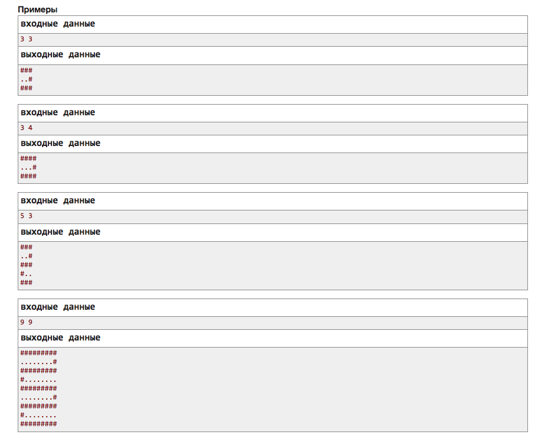
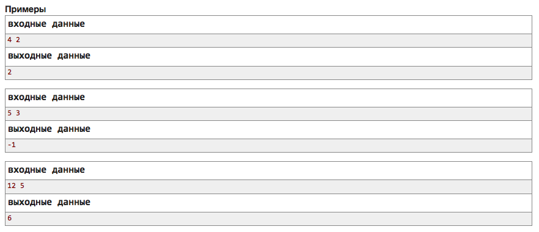

# Практика
---
#### Цель не просто сделать, чтобы работало, а сделать правильно. Для того, чтобы задание считалось сделанным, каждое сделанное вами задание надо показать.
---

1. Задание на логику  
Лиса Ciel учится программировать. Одним из её первых заданий было нарисовать лису! Однако для неё это показалось слишком сложным, так что вместо лисы она решила нарисовать змейку.

Змейка — это узор в прямоугольной таблице из n строк по m столбцов. Обозначим c-ю ячейку r-й строки как (r, c). Хвост змеи располагается в ячейке (1, 1), а её туловище простирается до (1, m), затем спускается на 2 ряда вниз до (3, m), затем простирается влево до (3, 1), и так далее. Таким образом, голова змеи расположена в одном из углов n-й строки.

Ваша задача — изобразить такую змею для лисы Ciel: пустые ячейки должны быть обозначены точками ('.'), а ячейки, накрытые телом змеи, должны быть заполнены решетками ('#').

Для полного понимания требуемого узора обратите внимание на примеры выходных данных.

#### Входные данные
В единственной строке записано два целых числа: n и m (3 ≤ n, m ≤ 50).

**n — нечетное число.**

#### Выходные данные
Выведите n строк. В каждой строке должна быть записана последовательность из m символов. Не выводите пробелы.

#### Пример:

2. Используя сокеты написать клиентскую часть, которая решает **school.sibears.ru 4042**  

---
### Домашнее задание

1. k-й делитель (очень легкая задача)

Даны два натуральных числа **n** и **k**. Найдите **k-й** в порядке возрастания делитель числа **n**, либо сообщите, что его не существует.

Делителем числа **n** является любое натуральное число, на которое число **n** делится без остатка.

Входные данные
В первой строке следуют два целых числа **n** и **k** *(1 ≤ n ≤ 10^15, 1 ≤ k ≤ 10^9)*.

Выходные данные
Если у числа **n** менее **k** делителей, выведите -1.

В противном случае, выведите **k-й** в порядке возрастания делитель числа **n**.

#### **Примечание**
В первом примере у числа 4 есть три делителя: 1, 2 и 4. Второй из них — 2.

Во втором примере у числа 5 есть только два делителя, 1 и 5. Ответ -1, потому что третьего делителя нет.

2. Сокеты - очень важная тема!

1) Предлагаю все-таки дорешать второе задание с занятия. В этом задании **сервер уже написан** и он находится по адресу `school.sibears.ru 4042`. **Необходимо написать клиентскую часть**, которая принимает данные с сервера, что-то делает и отправляет обратно. Как подключатся к серверу, работать с данными и т.д. есть в примере клиента с [прошлого занятия](https://github.com/sibears/school/blob/master/programming/l3.md). По факту необходимо придумать только саму логику решения задачи.

2) Так как никто не показал сделал ли задание на сокеты с прошлого ДЗ, то предлагаю также решить и его. Грубый бот все еще поднят. Подробности также в разделе *Домашнее задание* [прошлой лекции](https://github.com/sibears/school/blob/master/programming/l3.md). 

